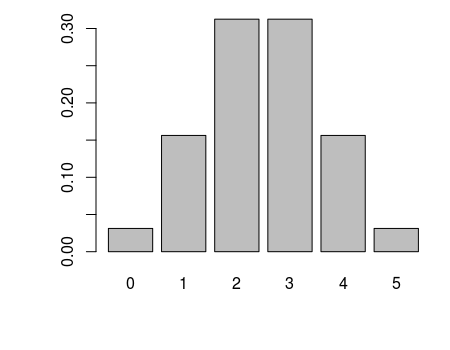
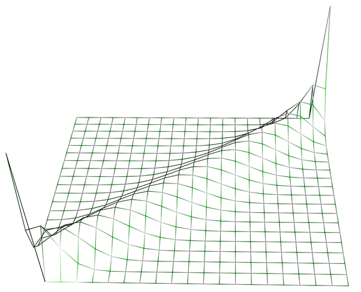
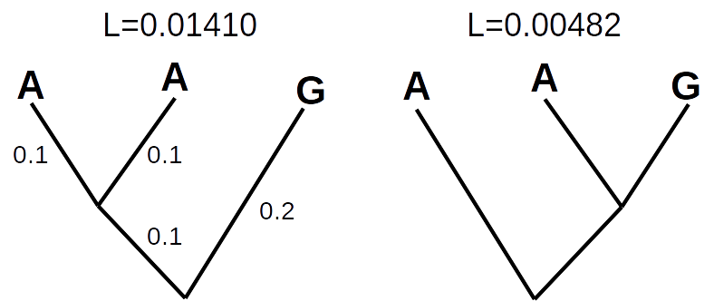
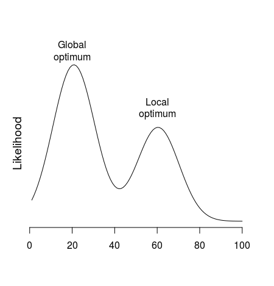

# Likelihood and Bayesian methods for reconstructing phylogenies
## Art Poon
### BIOL 4289B - Biosystematics and Phylogenetics

---

# Learning objectives
<table>
<tr>
<td>
<ul>
<li>What is likelihood?</li>
<li>What is wrong with Hamming distance?</li>
<li>What is a Markov chain?</li>
<li>Jukes-Cantor model</li>
<li>Recognize standard substitution models</li>
</ul>
</td>
<td>
<ul>
 <li>What is Felsenstein's pruning algorithm?</li>
 <li>How many trees are there?</li>
 <li>How do we explore tree space?</li>
 <li>What is Bayes' rule?</li>
 <li>What are pros and cons of Bayesian inference?</li>
</ul>
</td>
</tr>
</table>


---

# Likelihood

* To understand likelihood, you need to understand probability
* What is the probability of tossing 2 heads in 5 tries?
```
1.HHTTT  2.HTHTT  3.HTTHT  4.HTTTH  5.THHTT
6.THTHT  7.THTTH  8.TTHHT  9.TTHTH  10.TTTHH
```
`$${5\choose 2} = \frac{5!}{3!2!} = \frac{5\times 4\times 3\times 2\times 1}{3 \times 2\times 1 \times 2 \times 1} = 10$$`

---

`$$P(H=2,N=5) = {5\choose 2} p^2 (1-p)^{(5-2)} $$`

If it's a 'fair' coin, then $p=0.5$ and:
 $P=10\times 0.5^5 = \frac{10}{32} = 0.3125$



---



* likelihood does not integrate/sum to 1

---

# Computing likelihoods

<table>
<tr>
    <td width="50%">
    <ul>
        <li>Need a model of sequence evolution</li>
        <li>e.g., Jukes-Cantor model</li>
    <ul>
    <small>
    `$$ P(i,j|t) = \left\{ \begin{array}{lr}
    \frac{1}{4} + \frac{3}{4}e^{-\frac{4}{3}t} & if i= j \\
    \frac{1}{4} - \frac{1}{4}e^{-\frac{4}{3}t} & if i\ne j \\
    \end{array} \right. $$`
    </small>
    </td>
    <td>
        
    </td>
</tr>
</table>

---

# Likelihoods of trees



---

# Finding maximum likelihood

<table>
<tr>
  <td width="50%"><ul>
    <li>For most problems, there is no exact solution</li>
    <li>Use an optimization method to search for solution</li>
    <li>The danger is getting trapped in local optima!</li>
  </ul></td>
  <td></td>
</tr>
</table>

---

# Tree space is enormous!

| Number of tips | Number of trees | ..is like |
|----------------|-----------------|-----------|
| 3              | 3               | |
| 5              | 105             | |
| 10             | 34,459,425        | |
| 15             | $2.13\times 10^{14}$ | Total number of ants |
| 20             | $8.2\times 10^{21}$ | All grains of sand on all beaches |
| 25             | $1.2\times 10^{30}$ | All bacteria on Earth |

---

# How do we search tree space?

* Needed to develop "rearrangements" to move from one tree to the next.
* Nearest-neighbor interchange - swap two subtrees that share a common edge:


---

# Subtree prune and regraft


<small>Based on a figure by Steven A. Carr, modified from Krane & Raymer 2004.</small>

---

# Software

| | |
|-|-|
| [PAUP*](http://paup.sc.fsu.edu/) | Commercial license, packaged with [Geneious](http://www.geneious.com/) |
| [MEGA](http://megasoftware.net)  | Freeware, closed |
| [PhyML](http://www.atgc-montpellier.fr/phyml/) | Open source |
| [RAxML](http://sco.h-its.org/exelixis/software.html) | Open source |
| [FastTree2](http://www.microbesonline.org/fasttree/) | Open source, approximate ML |
| [GARLi](http://www.bio.utexas.edu/faculty/antisense/garli/Garli.html) | Open source, uses genetic algorithm |

<small>Not an exhaustive list!</small>

---


