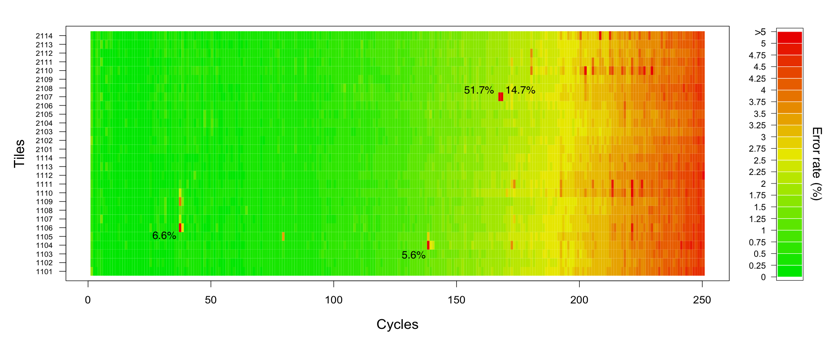
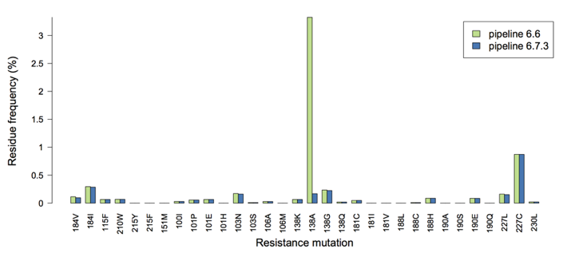
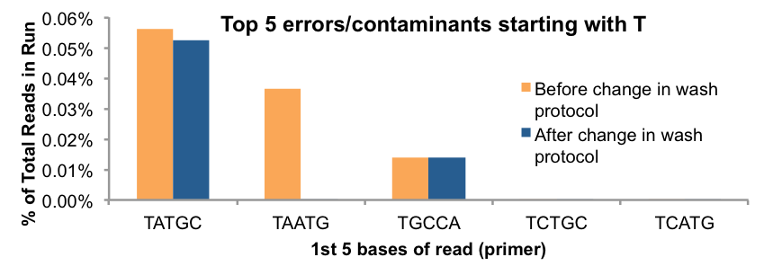
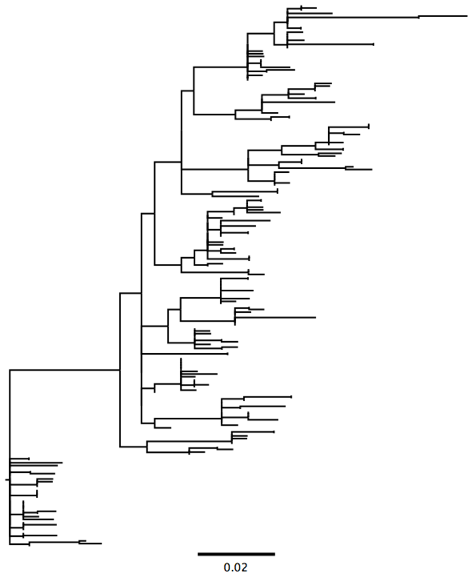

# Secuenciaci&oacute;n de nueva generaci&oacute;n para la evoluci&oacute;n del virus
<!--- Next-generation sequencing analysis for virus evolution -->
## Art Poon [@GitHub](https://github.com/ArtPoon)

#### Department of Pathology and Laboratory Medicine;  Microbiology and Immunology; and Applied Mathematics


# Materiales del seminario

* All slides, code and data are available at 
[http://github.com/PoonLab/courses](http://github.com/PoonLab/courses)
<center></center>
```
cd Desktop
git clone https://github.com/PoonLab/courses.git
```

* OR download a copy from the releases page.
* Both `*.tar.bz` and `*.zip` archives should be available. 


# &iquest;Por qu&eacute; necesitamos aprender a codificar?

* Secuenciaci&oacute;n de nueva generaci&oacute;n (SPG) datos son masivos
* difficult to analyze with conventional software (e.g., Excel)
* Bioinformatic tools for NGS analysis are extremely valuable
* The majority of tools are designed for human genomics; metagenomics
* Virus populations are too diverse - we need to make our own tools


# &iquest;Qu&eacute; significa codificar?

* You can't make a button for everything
* Command-line interface offers unlimited versatility
* The open source community provides many powerful resources for free (*e.g.* R)
* Unix-like systems have become the standard for bioinformatics
* The downside is that there is a steep learning curve


# Cumplir con la l&iacute;nea de comandos

<center></center> 


# Hagamos un poco de UNIX

```
$ pwd
/Users/art/git/courses/Cuernavaca
$ ls
data    scripts	slides
$ mkdir sandbox
```


# Sistemas SPG

* Usually people are dealing with 454, Ion Torrent and Illumina
* 454 is an abandoned platform
* 454 and Ion Torrent have insurmountable issues with homopolymer errors
* Illumina a *de facto* standard until better options become mainstream


# Los archivos de datos Illumina

* Raw data files are too large to allow these to accumulate uncompressed
* Compression reduces file size by about X fold
* Uncompress a file as follows:
```
# go to directory where you checked out courses.git
cd courses/Cuernavaca
gunzip --keep data/Zika-envelope.n1E4.R1.fastq.gz
```


# Formato FASTQ 

```
% head -n4 data/Zika-envelope.n1E4.R1.fastq
@otu1-2/1
CCGGGATCTTGTTGATTGTGAACGCTGCGGTACCTAAGGATGACACGCCTTTCAATCCATGTTTGTCCGTT
+
*F#FG#FFGGG#DGG#A2GGG?GGGC8G#EGGF#FGGGGGGGGEFGFGGFGGGGFFGGGE;G*GGGG/GGG
```
* Illiumina quality scores encoded as follows (see also [Wikipedia](https://en.wikipedia.org/wiki/FASTQ_format#Encoding)):
```
!"#$%&'()*+,-./0123456789:;<=>?@ABCDEFGHIJ
|                              |         |
0                              31        41
```


# Puntuaciones de calidad

* An empirical estimate of the probability that the base call is incorrect:
  
  $$Q = -10 \log_{10} P$$
  
* Based on instrument calibration by manufacturer. 
* Not all error variation is represented by these scores! 


# Otros problemas

1. Bad tile/cycle combinations
2. Longitudinal (between-run) contamination
3. Cross-sectional (within-run) contamination


# Mala azulejos / ciclos
<center>

</center>

* Not necessarily a big problem for random libraries
* Can be a really big problem for amplicon libraries!


# Significaci&oacute;n cl&iacute;nica

* Every subtype B sample in a MiSeq run had a substantial frequency (~3%) of resistance mutation E138A
* Quality scores were fine!

<center>

</center>


# Archivos de InterOp

* These are binary files (not human readable) that store quality and error metrics associated with the run.
* Try this:
```
less data/ErrorMetricsOut.bin
```
* Contents of this file are documented [here](http://support.illumina.com/content/dam/illumina-support/documents/documentation/software_documentation/sav/sequencing-analysis-viewer-v1_8_46-guide-15066069-a.pdf)
* We want to access the tile/cycle-specific &phi;X174 error rates contained in `ErrorMetricsOut.bin`


# Procesando la InterOp

* Try this (Python 2 only!):

```
% mkdir sandbox
% python scripts/parse-interop.py data/ErrorMetricsOut.bin \
  sandbox/errorrates.csv
% Rscript scripts/error-metrics.R sandbox/errorrates.csv \
  sandbox/errorrates.pdf
```


# Visualizar las tasas de error


# Contaminac&oacute;n cruzada longitudinal

* Reads from previous runs appear in the current run.

* Used modified PCR primer with extra T (TAATG, start 130926), alternated primers between runs.

<center></center>
<small>LC Swenson et al., Tropism Testing by MiSeq Is Comparable to 454-Based Methods but Exhibits Contamination Issues; Abstract #611, Conference on Retroviruses and Opportunistic Infections, Boston, MA, March 3-6, 2014</small>


# &iexcl;Blanquear al rescate!

* Eventually a revised wash protocol with bleach was [posted](https://drive.google.com/file/d/0B383TG7oJh2CTWp6MzZkMHBDd28/edit) by Illumina

<center>

</center>


# Contaminaci&oacute;n cruzada en el interior

* We were running hepatitis C virus (HCV) and human leukocyte antigen (HLA) loci 
samples on the same run, different indices

* Some reads in HCV sample were mapping to HLA, and vice versa!


# Asociados con &iacute;ndices compartidos


* Can be resolved by using unique indices!
<small>CJ Brumme et al., Within-Run Cross-Contamination in Deep Sequencing Applications on the Illumina MiSeq; Abstract #592, Conference on Retroviruses and Opportunistic Infections, Seattle, WA, February 23-26, 2015</small>


# Alineaci&oacute;n

* There are two general approaches to aligning short read data:

 1. *de novo* assembly of reads into contigs
 2. mapping to a reference genome

* *de novo* assembly can be a reasonable option if your objective is the consensus genome sequence
* reference mapping is better if your objective is variant detection


# Herramientas de m&oacute;dulo de mapeo basado en la referencia

* Generally work on the principle of looking up sequence fragments in a reference index
* Break down reference genome into fragments and record location of each
* Permit mismatches by augmenting index with all 1- and 2-off variants
* There are many mappers (BWA, bowtie2) with none clearly superior


# bowtie2

* Can index 2-off variants
* Allows soft clipping (5' or 3' end of read can be excluded from index query)
* Efficient "Smith-Waterman" alignment to reference after indexing


# Ejecutando bowtie2

* Create a reference index

```
bowtie2-build -q data/Zika-reference.fa data/zika
```

* Map Illumina data to index

```
bowtie2 -x data/zika -1 data/Zika-envelope.n1E4.R1.fastq.gz \
-2 data/Zika-envelope.n1E4.R1.fastq.gz \
 -S sandbox/first.sam
```


# Muy poco lecturas mapeadas a la referencia
```
10000 reads; of these:
  10000 (100.00%) were paired; of these:
    10000 (100.00%) aligned concordantly 0 times
    0 (0.00%) aligned concordantly exactly 1 time
    0 (0.00%) aligned concordantly >1 times
    ----
    10000 pairs aligned concordantly 0 times; of these:
      0 (0.00%) aligned discordantly 1 time
    ----
    10000 pairs aligned 0 times concordantly or discordantly; of these:
      20000 mates make up the pairs; of these:
        19979 (99.89%) aligned 0 times
        21 (0.10%) aligned exactly 1 time
        0 (0.00%) aligned >1 times
0.10% overall alignment rate
```


# &iquest;Que pas&oacute;?

* Rapid evolution of viruses means that references may be poor fit to data
* Try more lenient mapping (soft clips):

```
bowtie2 -x data/zika -1 data/Zika-envelope.n1E4.R1.fastq.gz \
-2 data/Zika-envelope.n1E4.R1.fastq.gz \
 -S sandbox/local.sam --local
```

* Now 6.85% overall alignment rate
* Better, but not good...


# Examinar los resultados de la mapeo

* Tablet: Java-based tool for visualizing SAM/BAM outputs
* Provides an interactive coverage plot.
* [Download Linux (64 bit) installer](https://ics.hutton.ac.uk/tablet/download-tablet/)
* Try it out using `local.sam` and `data/Zika-reference.ca`


# Mapeo adaptative de la referencia

* Most groups have adopted the approach of adapting the reference sequence
* Update reference with the consensus of whatever reads could be mapped
* The reference should eventually converge to the ideal consensus sequence
* Stop when there is no improvement in the number of reads mapped


# Formato SAM

* Based on [SAMtools](https://github.com/samtools/samtools) programs (SAM = sequence alignment/map)
* `.sam` has become a *de facto* standard output format for short read mappers

| # | Name  | Description          | #  | Name  | Description          |
|---|-------|----------------------|----|-------|----------------------|
| 1 | QNAME | Read label           | 7  | RNEXT | Ref. seq. of mate    |
| 2 | FLAG  | Bitwise flags        | 8  | PNEXT | Map location of 1st  |
| 3 | RNAME | Reference seq.       |    |       | base in mate         |
| 4 | POS   | Map location of 1st  | 9  | TLEN  | Insertion length     |
|   |       | base in read         | 10 | SEQ   | Read sequence        |
| 5 | MAPQ  | Mapping quality      | 11 | QUAL  | Read quality string  |    
| 6 | CIGAR | *see next slide*     |    |       |                      |


# CIGAR

* Compact Idiosyncratic Gapped Alignment Report
* A string representation of how the read aligns to the reference

| Token | Description |
|-------|-------------|
| M     | Matched     |
| I     | Insertion   |
| D     | Deletion    |
| S     | Soft clip   |

* For example, `5S45M1I4M5I89M1S`


# Adaptaci&oacute;n del consenso 

* My experience has been that *samtools* is confusing and poorly maintained
* Coded my own method in Python
  ```
  python scripts/adapt-ref.py sandbox/local.sam \
   data/Zika-reference.fa \
   sandbox/updated.fa
  ```

* Result:
  ```
  NC_012532.1, original length 10794
  Reads cover interval of length 1496
  Updated reference with 220 differences
  ```


* Workflow


# &iquest;Funciona?
 
* Try remapping FASTQ files to new reference

```
bowtie2-build -qf sandbox/updated.fa sandbox/updated

bowtie2 -x sandbox/updated \
 -1 data/Zika-envelope.n1E4.R1.fastq.gz \
 -2 data/Zika-envelope.n1E4.R2.fastq.gz \ 
 -S sandbox/updated.sam
```


# &iexcl;Si, funciona!

```
10000 reads; of these:
  10000 (100.00%) were paired; of these:
    403 (4.03%) aligned concordantly 0 times
    9597 (95.97%) aligned concordantly exactly 1 time
    0 (0.00%) aligned concordantly >1 times
    ----
    403 pairs aligned concordantly 0 times; of these:
      0 (0.00%) aligned discordantly 1 time
    ----
    403 pairs aligned 0 times concordantly or discordantly; of these:
      806 mates make up the pairs; of these:
        749 (92.93%) aligned 0 times
        57 (7.07%) aligned exactly 1 time
        0 (0.00%) aligned >1 times
96.25% overall alignment rate
```


# Podemos seguir...

```
$ python scripts/adapt-ref.py sandbox/updated.sam \ 
  sandbox/updated.fa sandbox/updated2.fa
NC_012532.1, original length 10790
Reads cover interval of length 1501
Updated reference with 10 differences
...
97.80% overall alignment rate
```

* but no improvement after third iteration.


# Echemos un vistazo al resultado de nuevo


* Try opening the new SAM file in Tablet


# &iexcl;Esto no es &uacute;til!

* Not a convenient format for studying evolution

* Low probability of overlap between two mapped reads chosen at random.

* Paired-end reads are on separate lines.

* What we would really like is an alignment of the merged and aligned 
reads covering a specific interval.


# Otro script de Python

```
python scripts/slice-sam.py -h  # see help menu first

python scripts/slice-sam.py -refname NC_012532.1 \
-left 1700 -right 2000 -min_overlap 250 -maxN 0.1 \
-qcut 15 sandbox/updated.sam sandbox/slice-1700-2000.fa
```


# &iexcl;Mucho mejor!

<center>

</center>


# Ahora podemos estudiar la evoluci&oacute;n

```
mafft sandbox/slice-1700-2000.fa > \
sandbox/slice-1700-2000.mafft.fa

fasttree2 -nt -gtr < sandbox/slice-1700-2000.mafft.fa > \
sandbox/slice-1700-2000.nwk
```


# 

<center>

</center>


# &iquest;Qu&eacute; pasa con la metagen&oacute;mica viral? 

* We are already doing this with multiple virus targets (HIV, hepatitis C virus)

* Need to be cautious about mapping to similar references because adaptive algorithm 
can cause collisions

* Try using `bowtie2` and `adapt-ref.py` on the following files:
    * `mixed-references.fa`
    * `mixed.R1.fastq`
    * `mixed.R2.fastq`


# My workflow:
```
  606  bowtie2-build -q -f data/mixed-references.fa sandbox/mixed-ref
  607  bowtie2 -x sandbox/mixed-ref -1 data/mixed.R1.fastq.gz -2 data/mixed.R2.fastq.gz -S sandbox/mixed.sam --local
  608  python scripts/adapt-ref.py -h
  609  python scripts/adapt-ref.py sandbox/mixed.sam data/mixed-references.fa sandbox/mixed.fa
  610  bowtie2-build -q -f sandbox/mixed.fa sandbox/mixed-ref1
  611  bowtie2 -x sandbox/mixed-ref1 -1 data/mixed.R1.fastq.gz -2 data/mixed.R2.fastq.gz -S sandbox/mixed2.sam --local
  612  python scripts/adapt-ref.py sandbox/mixed2.sam sandbox/mixed.fa  sandbox/mixed2.fa
  613  bowtie2-build -q -f sandbox/mixed2.fa sandbox/mixed-ref2
  614  bowtie2 -x sandbox/mixed-ref2 -1 data/mixed.R1.fastq.gz -2 data/mixed.R2.fastq.gz -S sandbox/mixed3.sam --local
```


# Have a look at your work in Tablet!


# How did we do?

* The true composition of the sample was:
    * Zika virus (NC_012532.1) = 1000 (6.7%)
    * HIV (HXB2) = 3000 (20%)
    * HCV (H77) = 6000 (40%)
    * random = 5000 (33.3%)
* To check:
  ```
  grep -c NC_012 mixed3.sam
  grep -c H77 mixed3.sam
  grep -c HXB2 mixed3.sam
  ```


# Advertencias

* These scripts were prepared for this workshop to demonstrate how 
Python, R and UNIX can be used to work with viral NGS data.

* They have not been tested and should not be used for research 
or clinical purposes.

* I have skipped many steps, such as read trimming.

* All materials are free to use under the GNU Affero GPL license.


# Expresiones de gratitud

* The laboratory results I have cited were obtained by the *BC Centre for Excellence in HIV/AIDS* 
(Chanson J. Brumme, Luke C. Swenson, Hope Lapointe, P. Richard Harrigan)

* My new lab is supported by grants from Genome Canada and the Canadian Institutes of Health Research

*  **&iexcl;Posiciones disponibles!**
